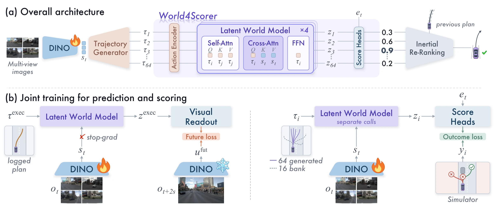
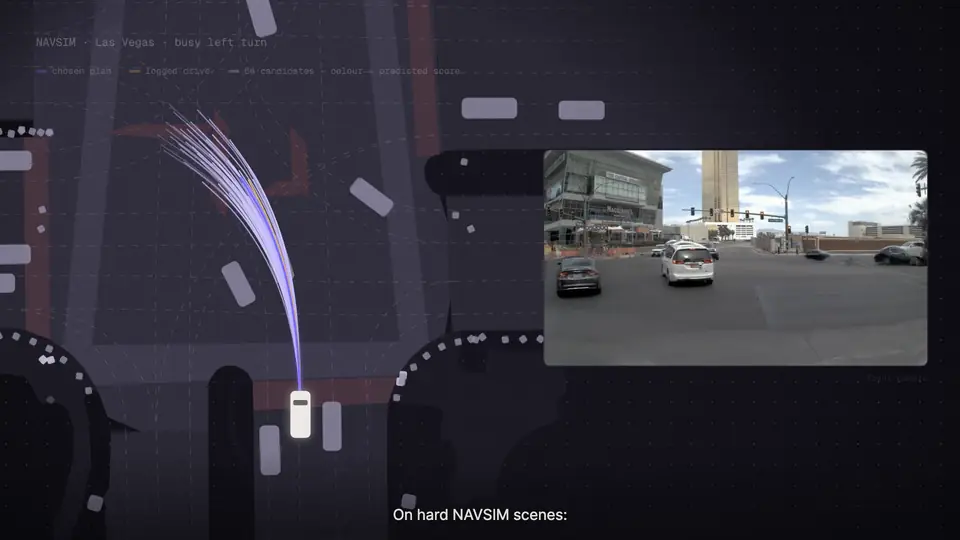
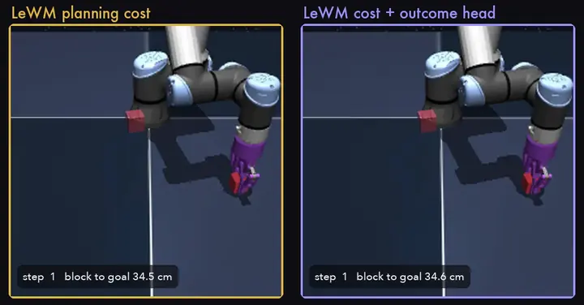
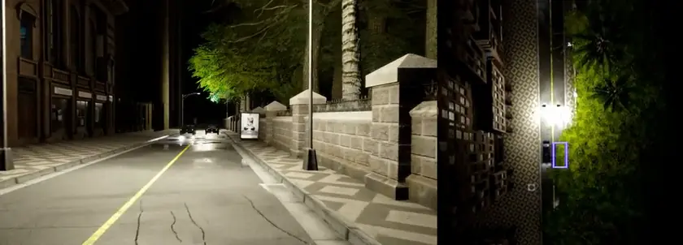

<div align="center">


### Outcome-Grounded World Modeling for Autonomous Driving

[](https://world4scorer.github.io/)
[](https://world4scorer.github.io/)
[](https://world4scorer.github.io/#video)
[](https://huggingface.co/pei2333/World4Scorer)
[](#results)
[](LICENSE)

[Jieyuan Pei](https://scholar.google.com/citations?user=xAAOO_0AAAAJ)<sup>1,2,3*‡</sup>, [Meiyi Lu](https://scholar.google.com/citations?user=2icZCggAAAAJ)<sup>4*</sup>, [Sining Ang](https://scholar.google.com/citations?user=ZBVnV8cAAAAJ)<sup>5</sup>, Yubo Zhao<sup>6</sup>, Zhangyi Hu<sup>3</sup>, [Mingwei Xu](https://scholar.google.com/citations?user=jOZPNeQAAAAJ)<sup>7</sup>, [Haokai Ding](https://scholar.google.com/citations?user=ikir1CUAAAAJ)<sup>8</sup>, Wei Li<sup>9</sup>,<br>
[Zihan You](https://scholar.google.com/citations?user=LnvFQJUAAAAJ)<sup>1,10</sup>, [Jianwei Zheng](https://scholar.google.com/citations?user=X0wntOEAAAAJ)<sup>9</sup>, Li Yu<sup>11</sup>, [Yifeng Pan](https://scholar.google.com/citations?user=Qh943UAAAAAJ)<sup>11</sup>, Ji Tao<sup>11</sup>, [Rongjunchen Zhang](https://scholar.google.com/citations?user=Ae41dcUAAAAJ)<sup>2</sup>, [Yan Wang](https://scholar.google.com/citations?user=QOZnsYYAAAAJ)<sup>1†</sup>

<sub><sup>1</sup>Institute for AI Industry Research (AIR), Tsinghua University · <sup>2</sup>HiThink Research · <sup>3</sup>The Hong Kong University of Science and Technology (Guangzhou) · <sup>4</sup>Zhejiang University · <sup>5</sup>University of Science and Technology of China · <sup>6</sup>SMBU · <sup>7</sup>University of Washington · <sup>8</sup>Mohamed bin Zayed University of Artificial Intelligence · <sup>9</sup>Zhejiang University of Technology · <sup>10</sup>Southeast University · <sup>11</sup>Changan Automobile</sub><br>
<sub><sup>*</sup>Equal contribution · <sup>†</sup>Corresponding author · <sup>‡</sup>Work done during an internship</sub>

</div>

https://github.com/user-attachments/assets/7f7e345d-5c78-4db3-aef1-135b5921842b

<p align="center"><sub>The 95-second overview film, with sound. Also on the <a href="https://world4scorer.github.io/#video">project page</a>.</sub></p>

## News

- **2026/09** Paper, [project page](https://world4scorer.github.io/) and a 95-second overview film are online.
- **Coming soon** Code in this repository and checkpoints on [Hugging Face](https://huggingface.co/pei2333/World4Scorer), once the paper is public on arXiv.

## Highlights

- **The scorer is a world model.** A generate-and-select planner must pick among plans that were never executed. World4Scorer predicts a state for every candidate with one shared predictor and reads each candidate's scores from that state.
- **Two kinds of supervision.** Simulator outcomes label every candidate; the one future the driving log actually recorded anchors the shared predictor. The future is used only during training.
- **State of the art on NAVSIM-v2:** 93.0 EPDMS on navtest (91.4 without inertial re-ranking), and 94.0 PDMS on NAVSIM-v1.
- **Closed loop:** 73.27 Driving Score on Bench2Drive-220, the highest in the comparison.
- **Beyond driving:** with the LeWM world model and planning budget unchanged, an outcome score lifts OGBench-Cube success from 68.9% to 73.6%.

## Method

<p align="center"></p>

The generator proposes 64 candidates. One predictor maps each candidate to a state; score heads read collision, drivable area, progress, time to collision and comfort from it. During training, a visual readout of the executed query predicts the frozen DINOv2 features of the front camera two seconds ahead, while simulator outcomes supervise all generated candidates and 16 bank candidates. At test time, inertial re-ranking keeps consecutive choices consistent.

## Demos

<table>
<tr>
<td width="50%"><br><sub><b>NAVSIM, Las Vegas.</b> 64 candidates every 0.5 s, coloured by predicted score; violet is the chosen plan, amber the logged drive.</sub></td>
<td width="50%"><br><sub><b>OGBench-Cube.</b> Same frozen LeWM world model and CEM budget. Left: LeWM alone fails. Right: with the outcome score it succeeds.</sub></td>
</tr>
<tr>
<td width="50%"><br><sub><b>Bench2Drive, closed loop.</b> A taxi cuts into the lane; the car brakes and goes on (driving score 100, 1.5×).</sub></td>
<td width="50%"><br><sub><b>Bench2Drive, closed loop.</b> At night a pedestrian steps into the road; the car slows down (driving score 100, 1.5×).</sub></td>
</tr>
</table>

More scenes, an interactive replay and the film are on the [project page](https://world4scorer.github.io/).

## Results

<table>
<tr><td valign="top">

**NAVSIM-v2** (navtest, EPDMS)

| Method | EPDMS |
|---|---:|
| **World4Scorer + inertial re-ranking** | **93.0** |
| **World4Scorer** | **91.4** |
| Drive-JEPA | 90.8 |
| DrivoR | 90.7 |
| Discrete-WAM | 90.4 |
| UniTeD | 90.1 |

</td><td valign="top">

**Bench2Drive-220** (closed loop)

| Method | Driving Score |
|---|---:|
| **World4Scorer** | **73.27** |
| ReCogDrive | 71.36 |
| SafeDrive | 66.77 |
| Drive-JEPA | 64.52 |
| DriveAdapter | 64.22 |
| ThinkTwice | 62.44 |

</td></tr>
<tr><td valign="top">

**NAVSIM-v1** (navtest, PDMS)

| Method | PDMS |
|---|---:|
| **World4Scorer** | **94.0** |
| DrivoR | 93.7 |
| Drive-JEPA | 93.7 |
| Discrete-WAM | 92.2 |
| LWDrive | 92.0 |

</td><td valign="top">

**OGBench-Cube** (success rate, %)

| Method | Success |
|---|---:|
| **LeWM + outcome score (ours)** | **73.64** |
| LeWM | 68.91 |
| PLDM | 65 |
| GCIQL | 64 |
| GCIVL | 56 |

</td></tr>
</table>

<sub>Bench2Drive success rate: 46.36%. The Bench2Drive system is adapted: trained on the official 1000-clip subset, with a route point and two deployment rules (paper appendix). Cube: LeWM and ours are our runs over 11 seeds × 50 episodes; the other rows are as reported by LeWM. Full tables are in the paper.</sub>

## Model zoo

| Model | Result | Download |
|---|---|---|
| NAVSIM planner (seed 3, epoch 23, 35.5M parameters) | 91.4 EPDMS · 93.0 with re-ranking · 94.0 PDMS | Hugging Face (coming soon) |
| Bench2Drive planner with route point (epoch 14) | 73.27 Driving Score | Hugging Face (coming soon) |
| OGBench-Cube outcome head `n10_r1` | 73.64% success | Hugging Face (coming soon) |

## Getting started

> **Note** The code will be released in this repository once the paper is public on arXiv. The steps below describe that release.

The code is built on [DrivoR](https://github.com/valeoai/DrivoR) (commit `f026654`), which builds on the NAVSIM devkit v1.1. The agent keeps DrivoR's module names (`drivoR`, `DrivoRModel`); the World4Scorer model is selected by the flags in `scripts/training/run_world4scorer.sh`.

<details>
<summary><b>Repository layout</b></summary>

```
navsim/                 NAVSIM devkit v1.1 and the World4Scorer agent (navsim/agents/drivoR)
scripts/training/       run_world4scorer.sh, the paper recipe
scripts/evaluation/     run_world4scorer_navtest.sh, NAVSIM-v1 submission and score
tools/                  future targets, inertial re-ranking (NAVSIM-v2), release verification
bench2drive/            CARLA / Bench2Drive training and closed-loop evaluation
ogbench_cube/           outcome head inside the LeWM planner on OGBench-Cube
docs/                   project page
assets/                 figures and animations of this README
```

</details>

<details>
<summary><b>1. Installation</b></summary>

```bash
conda create -n world4scorer python=3.9
conda activate world4scorer
pip install torch==2.1.2 torchvision==0.16.2 --index-url https://download.pytorch.org/whl/cu121
pip install -e ./nuplan-devkit
pip install -e .
```

</details>

<details>
<summary><b>2. Data</b></summary>

1. Download NAVSIM (OpenScene logs, sensor blobs, nuPlan maps) with the scripts
   in `download/`, following the
   [NAVSIM instructions](https://github.com/autonomousvision/navsim/blob/main/docs/install.md).
2. Download the DINOv2 ViT-S/14 weights with registers
   ([timm/vit_small_patch14_reg4_dinov2.lvd142m](https://huggingface.co/timm/vit_small_patch14_reg4_dinov2.lvd142m))
   into `weights/vit_small_patch14_reg4_dinov2.lvd142m/`.
3. Set the environment:

```bash
export NAVSIM_DEVKIT_ROOT=$PWD
export OPENSCENE_DATA_ROOT=/path/to/navsim/dataset
export NUPLAN_MAPS_ROOT=$OPENSCENE_DATA_ROOT/maps
export NAVSIM_EXP_ROOT=/path/to/exp
export DINO_WEIGHTS=$PWD/weights/vit_small_patch14_reg4_dinov2.lvd142m/model.safetensors
```

4. Metric caches for training labels and for navtest scoring:

```bash
python navsim/planning/script/run_train_metric_caching.py
python navsim/planning/script/run_metric_caching.py train_test_split=navtest \
    cache.cache_path=$NAVSIM_EXP_ROOT/metric_cache
```

5. Future targets: frozen DINOv2 features of the front camera 2 s ahead, one
   384-d vector per navtrain token.

```bash
python tools/precompute_future_embeddings.py --repo $NAVSIM_DEVKIT_ROOT \
    --openscene $OPENSCENE_DATA_ROOT --enc $DINO_WEIGHTS \
    --out $NAVSIM_EXP_ROOT/realized_future_emb_navtrain_f7_camf0.pt
export FUTURE_BANK=$NAVSIM_EXP_ROOT/realized_future_emb_navtrain_f7_camf0.pt
```

6. Candidate bank. Training adds 16 candidates per scene from the trajectory bank of
   [CLOVER](https://arxiv.org/abs/2605.15120) (code and data:
   [github.com/WilliamXuanYu/CLOVER](https://github.com/WilliamXuanYu/CLOVER)), with
   precomputed PDM sub-scores. We do not redistribute the bank; get it from CLOVER and
   convert it as below. `BANK_PACK` points to a directory with four arrays:

| file | shape | content |
|---|---|---|
| `tokens.npy` | (N,) bytes | navtrain scene tokens |
| `bank_candidates.npy` | (N, 64, 8, 3) float32 | candidates, ego frame, (x, y, heading) at 0.5 s steps |
| `bank_subscores.npy` | (N, 64, 7) float32 | NC, DAC, EP, TTC, comfort, DDC, PDMS |
| `bank_mask.npy` | (N, 64) bool | valid candidates |

Build the pack from CLOVER's candidate file (scene token, candidates in the ego frame,
and their PDM sub-scores) with

```bash
python tools/build_bank_pack.py candidates.pkl $BANK_PACK
```

</details>

<details>
<summary><b>3. Training (NAVSIM)</b></summary>

Four GPUs, 16 samples per GPU, 25 epochs (about 40 h on four A100/A800 GPUs).
The paper checkpoint is epoch 23 of seed 3.

```bash
export BANK_PACK=/path/to/bank_pack
bash scripts/training/run_world4scorer.sh world4scorer 3
```

Training reads many small files; copy the data to local disk or tmpfs first.

</details>

<details>
<summary><b>4. Evaluation (NAVSIM-v1 and NAVSIM-v2)</b></summary>

NAVSIM-v1 (PDMS), selection weights (NC, DAC, DDC, TTC, EP, comfort) = (1, 1, 0, 5, 5, 2):

```bash
bash scripts/evaluation/run_world4scorer_navtest.sh /path/to/checkpoint.ckpt
```

NAVSIM-v2 (EPDMS, one-stage navtest, non-reactive) with inertial re-ranking.
This step uses the official [NAVSIM v2 devkit](https://github.com/autonomousvision/navsim) at tag `v2.2`
(which contains the fix for Issue #151) for the LQR rollouts and the scorer; copy
`tools/inertial_reranking/score_one_stage_{shard,aggregate}.py` into its
`navsim/planning/script/` directory first.

```bash
export NAVSIM_V2_ROOT=/path/to/navsim_v2 V2_METRIC_CACHE=/path/to/navtest_v2_metric_cache
bash tools/inertial_reranking/run_navsim_v2.sh /path/to/checkpoint.ckpt /path/to/work_dir
```

The script writes four submissions: selection weights V1 or Nav2
(10, 13, 6, 14, 15, 2.1, the weights of the released DrivoR NAVSIM-v2 model),
each with λ = 0 (the model's own choice) and λ = 1 (inertial re-ranking,
penalty log(0.01 + 0.99·EC)). The paper reports `nav2_lam0` and `nav2_lam1`.
The λ = 0 submission must reproduce the plain model score.

</details>

<details>
<summary><b>5. Bench2Drive</b></summary>

Requires CARLA 0.9.15 and a [Bench2Drive](https://github.com/Thinklab-SJTU/Bench2Drive)
checkout. `B2D_DATA` is the official 1000-clip Bench2Drive-base set.

```bash
export B2D_DATA=/path/to/bench2drive_base CARLA_ROOT=/path/to/carla BENCH2DRIVE_ROOT=/path/to/Bench2Drive
bash bench2drive/train_b2d.sh 0,1,2,3          # sidecars, route-blind model, route-point model
bash bench2drive/run_b2d_eval.sh $BENCH2DRIVE_ROOT/leaderboard/data/bench2drive220.xml - \
    bench2drive/b2d_agent/cfg_tpv2_both.json results_b2d.json 0
```

`cfg_tpv2_both.json` is the paper configuration: the route point 20 m ahead as
an ego input, route re-ranking (`route_align`), and command retention
(`cmd_behind`). The agent re-plans every 0.5 s and tracks the selected
trajectory with a PID controller.

</details>

<details>
<summary><b>6. OGBench-Cube</b></summary>

Uses [LeWM](https://github.com/lucas-maes/le-wm) through `stable-worldmodel==0.1.1`
and `stable-pretraining==0.1.8`, with the released `quentinll/lewm-cube` weights.

```bash
GPU=0 bash ogbench_cube/reproduce_cube.sh
```

The script evaluates the released LeWM cost, collects simulator-labelled
candidates on separate seeds, trains the outcome head, selects the blend
coefficient on tuning seeds (the paper's run selected 0.3), and evaluates on the
11 report seeds. CEM runs 10 iterations, as in LeWM Appendix D.

</details>

<details>
<summary><b>7. Verify the release</b></summary>

```bash
python tools/verify_release.py --count-params
```

checks that `navsim/` equals the code that produced the paper results (two
Bench2Drive additions to `drivor_model.py` are inactive unless enabled) and that
the model has 35,520,926 parameters.

</details>

## Citation

```bibtex
@article{pei2026world4scorer,
  title   = {World4Scorer: Outcome-Grounded World Modeling for Autonomous Driving},
  author  = {Pei, Jieyuan and Lu, Meiyi and Ang, Sining and Zhao, Yubo and Hu, Zhangyi and Xu, Mingwei and Ding, Haokai and Li, Wei and You, Zihan and Zheng, Jianwei and Yu, Li and Pan, Yifeng and Tao, Ji and Zhang, Rongjunchen and Wang, Yan},
  journal = {arXiv preprint},
  year    = {2026}
}
```

If you use the candidate bank, please also cite CLOVER:

```bibtex
@article{ang2026clover,
  title   = {{CLOVER}: Closed-Loop Value Estimation and Ranking for End-to-End Autonomous Driving Planning},
  author  = {Ang, Sining and Yang, Yuguang and Chen, Canyu and Wang, Yan},
  journal = {arXiv preprint arXiv:2605.15120},
  year    = {2026}
}
```

## License and acknowledgements

Released under the Apache License 2.0 (see `LICENSE` and `NOTICE`). The code
builds on [DrivoR](https://github.com/valeoai/DrivoR),
[NAVSIM](https://github.com/autonomousvision/navsim),
[nuPlan-devkit](https://github.com/motional/nuplan-devkit),
[Bench2Drive](https://github.com/Thinklab-SJTU/Bench2Drive), and
[LeWM](https://github.com/lucas-maes/le-wm). We thank their authors.
